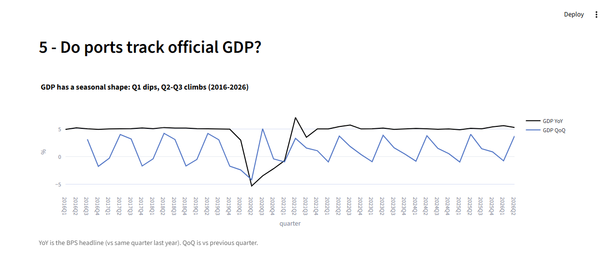
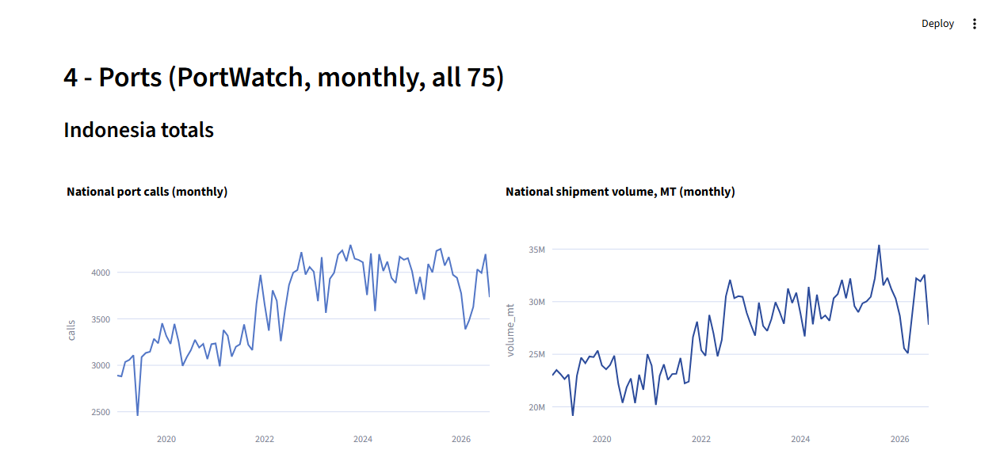
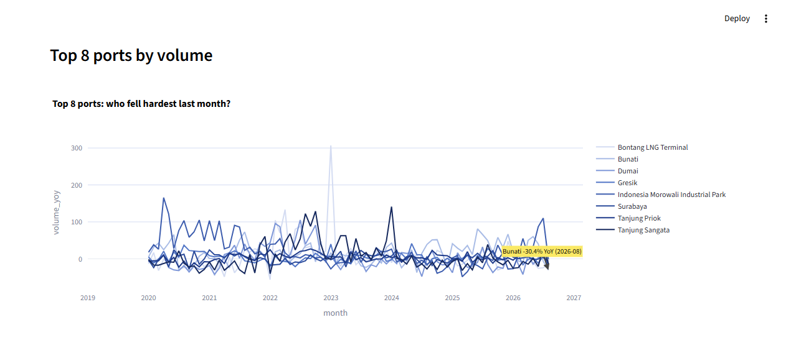

# Lights vs Numbers - Indonesia GDP Data Analysis

Data analysis comparing official GDP against independent activity signals.
**No index, no verdicts, no weights.** Just numbers, charts and tables, with
the story annotated on the graphs.


## What it shows

| Signal | Source | Status |
|---|---|---|
| Port activity, all 75 ports | IMF PortWatch via HDX | Live, no key needed |
| Consumption searches | Google Trends | Live, no key needed |
| Official quarterly GDP, 2016-2026 | BPS releases | Full history in `data/raw/official_gdp_quarterly.csv` |
| Nighttime lights (VIIRS) | Google Earth Engine | Sample data (live feed planned) |
| Electricity vs manufacturing | BPS WebAPI | Sample data (live feed planned) |

Charts built on sample data are labeled in the app, so live and sample
series are never mixed up.

## Screenshots

One dot per quarter: when ports disagreed with GDP.



National port calls with the weakest month called out.



Top 8 ports with the hardest faller labeled.



## Data analysis

This is a **data analysis project** first, a dashboard second. The workflow
is: acquire (free APIs + official releases) -> clean and aggregate (monthly
port activity across 75 ports, weekly search indices, quarterly GDP with
per-row sources) -> exploratory analysis (`eda/` scripts producing 15
figures, 12 tables and the numbered findings in `reports/FINDINGS.md`, where
every number traces back to a table) -> present (annotated charts, no
black-box scores). Correlation panels report observed co-movement with n
stated, never causality, never verdicts.

Tools: **Python 3.12**, **pandas**, **Plotly**, **Streamlit**, **pytest**
(unit + dashboard smoke tests, both in CI), **GitHub Actions**, HDX
(PortWatch), Google Trends, BPS statistical releases.

## Quickstart

```powershell
py -m venv .venv
.\.venv\Scripts\Activate.ps1
pip install -r requirements.txt

copy .env.example .env    # add GEE_PROJECT / BPS_KEY when you have them
python main.py            # 4 fetchers + descriptive join
streamlit run dashboard/app.py
```

No keys? The pipeline still runs end to end; the two key-gated signals use
their labeled sample files. To go live later: `GEE_PROJECT` from Google
Cloud, `BPS_KEY` from https://webapi.bps.go.id/developer/, then
`python scripts/discover_bps_vars.py --keyword listrik` and pin the IDs in
`config.yaml:bps.var_ids`.

## Planned additions

- **Live nighttime lights**: swap the sample file for VIIRS VNP46A2 via
  Earth Engine once `GEE_PROJECT` is set (module already written, just
  needs the key).
- **Live electricity series**: swap the sample file for the PLN/BPS
  consumption series via the BPS WebAPI (`scripts/discover_bps_vars.py`
  finds the variable IDs).
- **GDP backfill**: QoQ 2016Q1-Q2 plus 2026Q3 when BPS releases it
  (expected Nov 2026); every row in the dataset carries its source URL.
- **Reviewed composite**: a single headline number may be adopted later,
  but only with an economist-made recipe. Until then: description only.
- **One-click deploy**: Streamlit Community Cloud reads this repo as is
  (processed data is committed, no pipeline run needed).

## What this is not

No composite index, no PCA/fixed weights, no automatic verdicts, no
thresholds, no judgment colors. Correlation panels report observed
co-movement with n stated, never causality.

## Layout

- `modules/` - one file per signal + `combine.py` (descriptive quarterly join)
- `dashboard/` - Streamlit app + `palette.py` (single color source)
- `data/raw/official_gdp_quarterly.csv` - the GDP dataset (values + sources)
- `data/processed/` - pipeline outputs (`overview.csv` + per-signal files)
- `eda/` - excavation scripts to `eda/figures/` + `reports/tables/`
- `reports/FINDINGS.md` - numbered findings, every number traceable
- `tests/` - `pytest -q` (unit) + dashboard smoke test, both run in CI
- `.github/workflows/ci.yml` - install, compile check, tests, dashboard smoke
